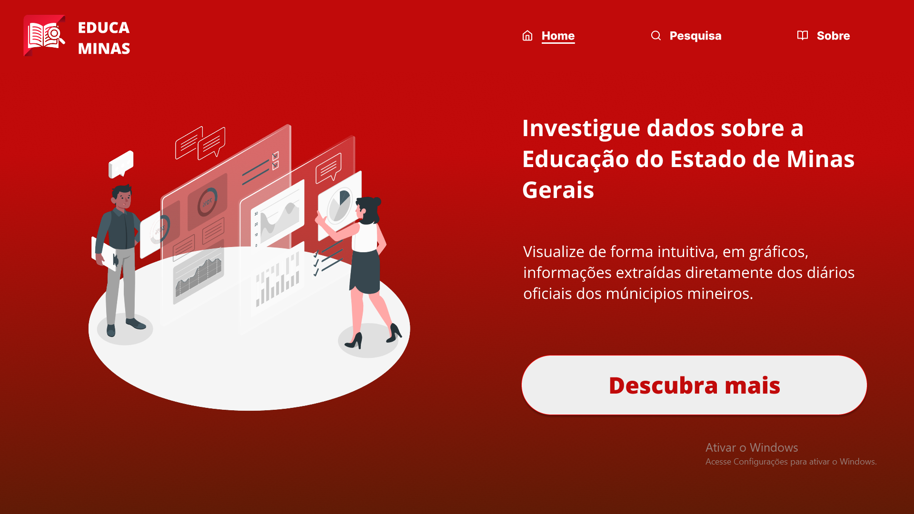
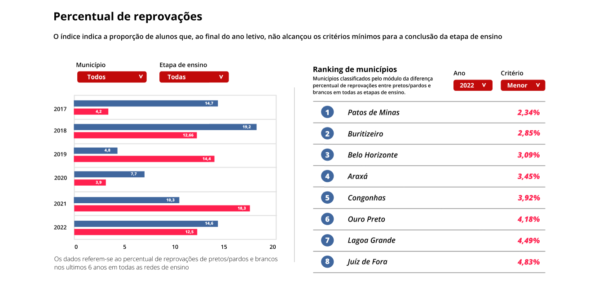
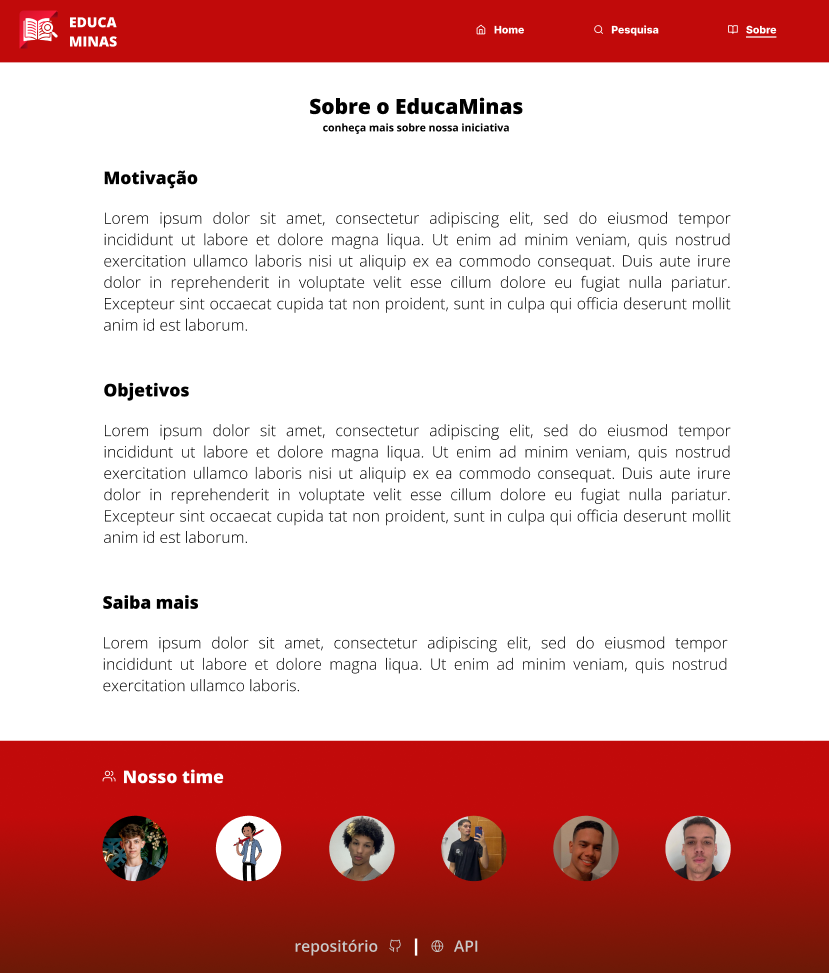

# 2024-1-EducaMinas

## Sobre
Este é um projeto desenvolvido na disciplina Métodos de Desenvolvimento de Software (MDS) ofertada no curso de Engenharia de Software na Universidade de Brasília (UnB), que visa reunir em um só local dados sobre a Educação do estado de Minas Gerais, utilizando dados extraídos da pesquisa educacional realizada pelo INEP.

## Objetivos
Este projeto tem por objetivos:
- **Facilitar a visualização de dados através de gráficos simples**
- **Ressignificar os dados utilizando rankings e comparações entre diferentes indicadores**
- **Possibilitar uma interpretação mais profunda dos dados, voltada para o lado social do ensino mineiro**

## Documentação

Para visualizar a documentação completa do projeto: [Documentação](https://unb-mds.github.io/2024-1-EducaMinas-frontend/)

Em nossa documentação, estão disponíveis:

- [Como contribuir](https://unb-mds.github.io/2024-1-EducaMinas-frontend/contributing/)
- [StoryMap](https://unb-mds.github.io/2024-1-EducaMinas-frontend/project/storymap/)
- [Requisitos](https://unb-mds.github.io/2024-1-EducaMinas-frontend/project/requirements/)
- [Personas](https://unb-mds.github.io/2024-1-EducaMinas-frontend/project/personas/)
- [Estrutura Analítica de Projeto(EAP)](https://unb-mds.github.io/2024-1-EducaMinas-frontend/project/eap/)
- [Arquitetura e Tecnologias](https://unb-mds.github.io/2024-1-EducaMinas-frontend/project/arquitetura/)

## Protótipo 

- Para o protótipo completo: [Protótipo](https://unb-mds.github.io/2024-1-EducaMinas-frontend/project/prototipo/)
- Para a apresentação do protótipo no FIGMA: [Apresentação](https://www.figma.com/proto/S3GrGX5HUojoKvHAnFNiXy/EducaMinas?type=design&node-id=1-3&t=5Cn41AoersmZdQp3-0&scaling=scale-down&page-id=0%3A1)

### Página Inicial

### Página de Pesquisa

### Página Sobre

## Equipe

<table style="margin-left: auto; margin-right: auto;">
    <tr>
        <td align="center">
            <a href="https://github.com/rafgpereira">
                
                <h5 class="text-center">Rafael Pereira</h5>
            </a>
        </td>
        <td align="center">
            <a href="https://github.com/johan-rocha">
                
                <h5 class="text-center">Johan Rocha</h5>
            </a>
        </td>
        <td align="center">
            <a href="https://github.com/JoaoPedrooSS">
                
                <h5 class="text-center">João Pedro</h5>
            </a>
        </td>
        </td>
        <td align="center">
            <a href="https://github.com/jlucasiqueira">
                
                <h5 class="text-center">João Lucas</h5>
            </a>
        </td>
        <td align="center">
            <a href="https://github.com/dudupaz">
                
                <h5 class="text-center">Carlos Eduardo</h5>
            </a>
        </td>
          <td align="center">
            <a href="https://github.com/DanielFsR">
                
                <h5 class="text-center">Daniel Ferreira</h5>
            </a>
        </td>
</table>

