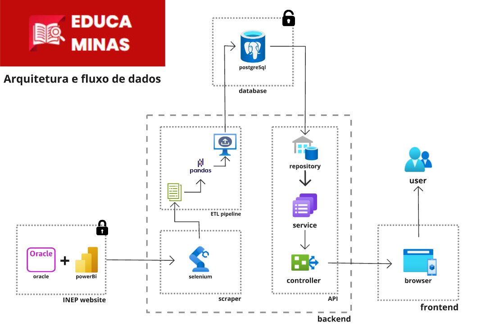

# [EducaMinas](https://educaminas.vercel.app/)

[](https://codecov.io/gh/unb-mds/2024-1-EducaMinas-frontend)
[](./LICENSE)
[](https://img.shields.io/github/issues/unb-mds/2024-1-EducaMinas-frontend)
[](https://img.shields.io/github/contributors/unb-mds/2024-1-EducaMinas-backend)

---

<div align="center">
    
</div>


---

Para melhor divisão e organização, o EducaMinas está dividido em dois repositórios.

Você está no **Frontend**. Acesse também:

- [🤖 **Backend**](https://github.com/unb-mds/2024-1-EducaMinas-backend)

---

O [EducaMinas](https://educaminas.vercel.app/) é um projeto desenvolvido na disciplina Métodos de Desenvolvimento de Software (MDS) ofertada no curso de Engenharia de Software na Universidade de Brasília (UnB), que visa reunir em um único local dados sobre a educação no estado de Minas Gerais, utilizando informações extraídas da pesquisa educacional realizada pelo INEP. A plataforma permite diferentes interpretações dos dados, com ênfase no aspecto social do ensino mineiro.

O projeto é um software livre e está sob a licença [MIT](./LICENSE).

---

## 🗒️ Sumário

- [🚩 EducaMinas](#educaminas)
  - [🗒️ Sumário](#-sumário)
  - [🏁 Início](#-início)
    - [🏞️ Ambiente e Pré-requisitos](#-ambiente-e-pré-requisitos)
    - [📲 Instalação](#-instalação)
    - [⚙️ Execução](#-execução)
  - [🛠️ Guia de contribuição](#-guia-de-contribuição)
  - [📒 Documentação e muito mais!](#-documentação-e-muito-mais!)
  - [🏛️ Arquitetura](#-arquitetura)
  - [📆 Board](#-board)
  - [🖼️ Protótipo](#-protótipo)
  - [🧑🏽‍💻 Desenvolvedores](#-desenvolvedores)


---

## 🏁 Início

Siga os passos abaixo para executar o **frontend** do [**EducaMinas**](https://educaminas.vercel.app/):

### 🏞️ Ambiente e Pré-requisitos

Para rodar o projeto é fundamental ter algumas dependências globais:

- Node
- Python

Para visualizar versões, links e as instruções completas de configuração do ambiente: [**Ambiente e Pré-requisitos**](https://unb-mds.github.io/2024-1-EducaMinas-frontend/environment/)


### 📲 Instalação

Após configurar o [**Ambiente e Pré-requisitos**](https://unb-mds.github.io/2024-1-EducaMinas-frontend/environment/), em um diretório de sua máquina, abra o terminal e execute:

```bash
git clone https://github.com/unb-mds/2024-1-EducaMinas-frontend.git
```

Com o repositório do frontend devidamente clonado, você terá acesso à aplicação **Next.js** e à documentação **MkDocs**:

#### **Next.js**

Navegue até o diretório raiz do repositório clonado:

```bash
cd 2024-1-EducaMinas-frontend
```
Em seguida instale as dependências do EducaMinas:

```bash
npm install
```

#### **MkDocs**

Navegue até o diretório `docs` localizado dentro da raiz:

```bash
cd docs
```
Instale as dependências da Documentação do EducaMinas:

```bash
pip install mkdocs mkdocs-material
```

### ⚙️ Execução

#### **Next.js**

Para executar a aplicação Next em sua máquina, execute no diretório raiz:

```bash
npm run dev
```
O servidor será inicializado e estará disponível na porta 3000 do localhost:

```bash
http://localhost:3000/
```

Demais comandos para execução de testes, builds e linter podem ser encontrados na guia _scripts_  do arquivo `package.json` na pasta raiz.

No arquivo `.env` na raiz, é possível alternar a conexão com a API, por padrão, a conexão é feita com a API em produção, mas se você estiver executando localmente o **backend**, pode alternar para a url disponível com `localhost`.

#### **MkDocs**

Para executar a aplicação MkDocs em sua máquina, navegue até a pasta `docs`:

```bash
cd docs
```
Inicialize:

```bash
mkdocs serve
```
O servidor será inicializado e estará disponível em:

```bash
http://127.0.0.1:8000/
```
---

## 🛠️ Guia de contribuição

**Para acessar o guia completo de contribuição**: [**Guia de Contribuição**](https://unb-mds.github.io/2024-1-EducaMinas-frontend/contributing-frontend/)

Nele, você encontra as respostas para as seguintes questões:

- [Relatar um problema](https://unb-mds.github.io/2024-1-EducaMinas-frontend/contributing-frontend/)
- [Implementar uma funcionalidade](https://unb-mds.github.io/2024-1-EducaMinas-frontend/contributing-frontend/):
    - [Clone](https://unb-mds.github.io/2024-1-EducaMinas-frontend/contributing-frontend/)
    - [Dependências](https://unb-mds.github.io/2024-1-EducaMinas-frontend/contributing-frontend/)
    - [Branches](https://unb-mds.github.io/2024-1-EducaMinas-frontend/contributing-frontend/)
    - [Execução](https://unb-mds.github.io/2024-1-EducaMinas-frontend/contributing-frontend/)
    - [Commits](https://unb-mds.github.io/2024-1-EducaMinas-frontend/contributing-frontend/)
    - [Pull Requests](https://unb-mds.github.io/2024-1-EducaMinas-frontend/contributing-frontend/)
    - [Revisão e Merge](https://unb-mds.github.io/2024-1-EducaMinas-frontend/contributing-frontend/)

---

## 📒 Documentação e muito mais!

**Para acessar a documentação completa**: [**Documentação EducaMinas**](https://unb-mds.github.io/2024-1-EducaMinas-frontend/)

Nela, você encontra os seguintes tópicos:

- [Início](https://unb-mds.github.io/2024-1-EducaMinas-frontend/)
- [Sprints](https://unb-mds.github.io/2024-1-EducaMinas-frontend/sprints/sprint-0/)
- [Projeto](https://unb-mds.github.io/2024-1-EducaMinas-frontend/project/personas/):
    - [Personas](https://unb-mds.github.io/2024-1-EducaMinas-frontend/project/personas/)
    - [StoryMap](https://unb-mds.github.io/2024-1-EducaMinas-frontend/project/storymap/)
    - [Requisitos](https://unb-mds.github.io/2024-1-EducaMinas-frontend/project/requirements/)
    - [EAP](https://unb-mds.github.io/2024-1-EducaMinas-frontend/project/eap/)
    - [API](https://unb-mds.github.io/2024-1-EducaMinas-frontend/project/servicos/)
    - [Arquitetura e Tecnologias](https://unb-mds.github.io/2024-1-EducaMinas-frontend/project/arquitetura/)
    - [Protótipo](https://unb-mds.github.io/2024-1-EducaMinas-frontend/project/prototipo/)
- [Como contribuir](https://unb-mds.github.io/2024-1-EducaMinas-frontend/environment/):
    - [Ambiente de desenvolvimento](https://unb-mds.github.io/2024-1-EducaMinas-frontend/environment/)
    - [Primeiros passos - frotend](https://unb-mds.github.io/2024-1-EducaMinas-frontend/contributing-frontend/)
    - [Primeiros passos - backend](https://unb-mds.github.io/2024-1-EducaMinas-frontend/contributing-backend/)
- [Sobre](https://unb-mds.github.io/2024-1-EducaMinas-frontend/about/)

---

## 🏛️ Arquitetura

Confira a visualização geral da arquitetura do [**EducaMinas**](https://educaminas.vercel.app):

<div align="center">
    
</div>

---

## 📆 Board

Acesse nosso [**Board no GitHub**](https://github.com/orgs/unb-mds/projects/22/views/2) e acompanhe o desenvolvimento dos dois repositórios simultâneamente: [**Board EducaMinas**](https://github.com/orgs/unb-mds/projects/22/views/2)

---

## 🖼️ Protótipo

Visualize nosso protótipo diretamente no FIGMA: [**Protótipo EducaMinas**](https://www.figma.com/proto/S3GrGX5HUojoKvHAnFNiXy/EducaMinas?type=design&node-id=1-3&t=5Cn41AoersmZdQp3-0&scaling=scale-down&page-id=0%3A1)

---

## 🧑🏽‍💻 Desenvolvedores

<center>
<table style="margin-left: auto; margin-right: auto;">
    <tr>
        <td align="center">
            <a href="https://github.com/rafgpereira">
                
                <h5 class="text-center">Rafael Pereira</h5>
            </a>
        </td>
        <td align="center">
            <a href="https://github.com/johan-rocha">
                
                <h5 class="text-center">Johan Rocha</h5>
            </a>
        </td>
        <td align="center">
            <a href="https://github.com/JoaoPedrooSS">
                
                <h5 class="text-center">João Pedro</h5>
            </a>
        </td>
        </td>
        <td align="center">
            <a href="https://github.com/jlucasiqueira">
                
                <h5 class="text-center">João Lucas</h5>
            </a>
        </td>
        <td align="center">
            <a href="https://github.com/dudupaz">
                
                <h5 class="text-center">Carlos Eduardo</h5>
            </a>
        </td>
          <td align="center">
            <a href="https://github.com/DanielFsR">
                
                <h5 class="text-center">Daniel Ferreira</h5>
            </a>
        </td>
</table>
</center>
